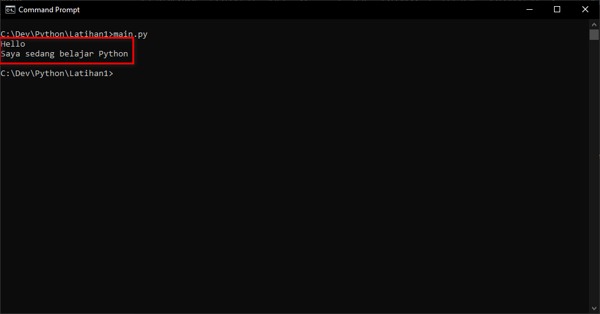
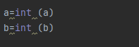

# Latihan 3 Belajar Menggunakan Python

## Instalasi Python
Download Python di wesite resmi python.org sesuai OS yang di pakai  
Install dan centah Add path untuk menambahkan path agar bisa menjalankan python melalui CMD
 
Cek apakah Python sudah terinstall dengan cara buka CMD lalu ketikan Python --version maka akan muncul veri python yang telah terinstall

## Membuat File Python
### Latihan 1 menampilkan "Hello" dan "Saya sedang belajar Python" di layar
Pertama buka VScode dan buat file baru file.py dan masukan printah seperti pada gambar

Untuk menjalankan nya bisa melalui VScode atau CMD  
Jika melalui VScode bisa dengan menekan tombol play di pojok kanan atas

Maka hasilnya seperti ini
 
jika melalui CMD maka harus masuk ke folder file python berada dan ketikan nama file tersebut seperti pada gambar

Maka hasilnya seperti ini

### Latihan 2 Menjumlahkan dua buah bilangan menggunakan variabel a dan b
Buat file baru untuk latihan 2  
  
Masukan variabel untuk a dan b 
 
Masukan perintah print untuk tampilkan hasil dari penjumlahan a dan b seperti pada gambar  
 
Jalankan program dengan cara yang sama seperti pada latihan 1 dan hasilnya seperti ini 
 
Ini untuk tampilan pada CMD 
 
### Latihan 3 Menjalankan IDLE
Karna pada latihan 1 dan Latihan 2 di atas saya menggunakan Vscode jadi saya Download terlebih dahulu PyCharm nya di https://www.jetbrains.com/pycharm/download lalu install seperti biasa ☺
 
Jika sudah terinstall buka aplikasinya dan buat project baru Lab2py dengan nama file Latihan3.py
 
Jika sudah lanjut ke pengkodingan dan gunakan fungsi input dari keyboard  
Pertama masukan variabel di ikuti dengan printah input untuk memasukan nilai variabel seperti pada gambar
 
Selanjutnya tampilkan di layar nilai variabel yang telah di inputkan seperti pada gambar
 
lalu Cetak kedua variabel dan gabungkan dengan format string  
Disini saya menggunakan fungsi generic dan format agar bisa gabungkan 2 angka  
Pertama buat format terlebih dahulu   
disini saya memasukan  format_string = f" Hasil penggabungan a dan b adalah ={a}{b}" fungsinya kita membuat format baru dengan  menggunakan f(format) di ikuti dengan kalimat yang ingin di tampilkan dan tarik data variabel untuk di gabungkan seperti pada gambar 
 
Untuk menampilkan hasilnya kita lakukan printah print ke format yang telah di buat tadi Maka hasilnya seperti ini
 
Lanjut ke konversi variabel  
Disini kita ubah dulu untuk variabel a dan be ke integer seperti pada gambar
 
Jika sudah maka disini saya melakukan 2 pengolahan yaitu penjumlahan dan pembagian caranya sama seperti pada penggabungan di atas namun bedanya kita tambahkan operator penjumlahan dan pembagian seperti pada gambar  
 
Dan untuk menampilkan hasilnya lakukan dengan perintah print ke format yang telah dibuat dan hasilnya seperti ini  
 

