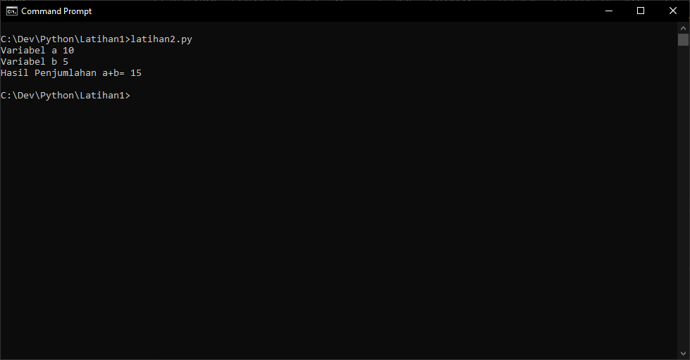

# Latihan 3 Belajar Menggunakan Python

## Instalasi Python
Download Python di wesite resmi python.org sesuai OS yang di pakai  
Install dan centah Add path untuk menambahkan path agar bisa menjalankan python melalui CMD
 
Cek apakah Python sudah terinstall dengan cara buka CMD lalu ketikan Python --version maka akan muncul veri python yang telah terinstall

## Membuat File Python
### Latihan 1 menampilkan "Hello" dan "Saya sedang belajar Python" di layar
Pertama buka VScode dan buat file baru file.py dan masukan printah seperti pada gambar

Untuk menjalankan nya bisa melalui VScode atau CMD  
Jika melalui VScode bisa dengan menekan tombol play di pojok kanan atas

Maka hasilnya seperti ini

jika melalui CMD maka harus masuk ke folder file python berada dan ketikan nama file tersebut seperti pada gambar

Maka hasilnya seperti ini

### Latihan 2 Menjumlahkan dua buah bilangan menggunakan variabel a dan b
Buat file baru untuk latihan 2

Masukan variabel untuk a dan b

Masukan perintah print untuk tampilkan hasil dari penjumlahan a dan b seperti pada gambar

Jalankan program dengan cara yang sama seperti pada latihan 1 dan hasilnya seperti ini

Ini untuk tampilan pada CMD

### Latihan 3 

